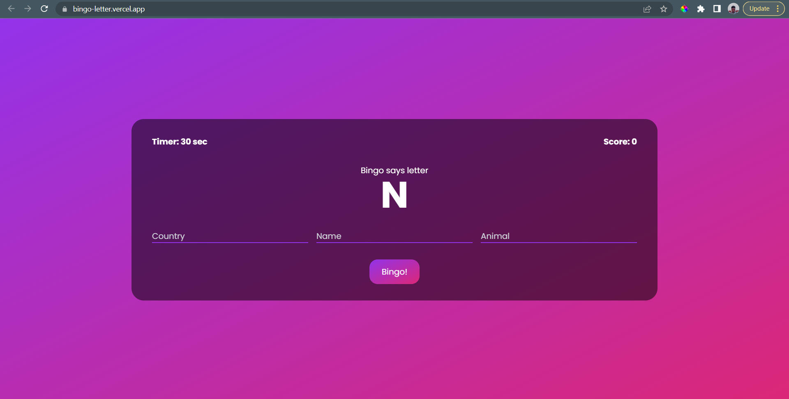
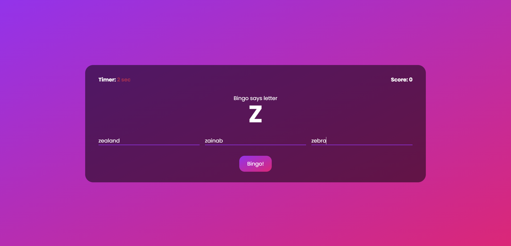
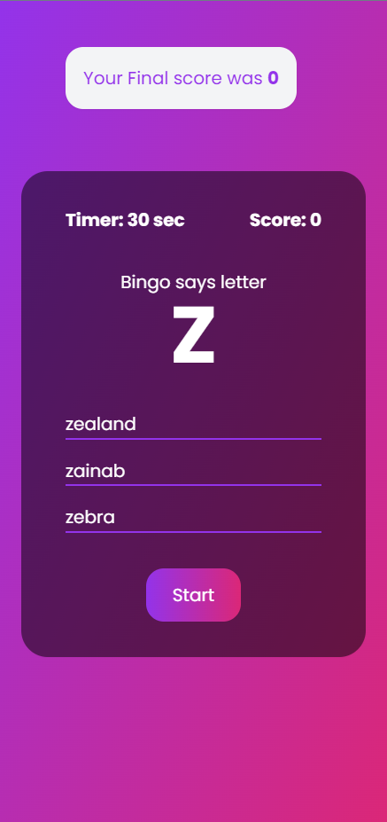

# Bingo Letter
This is my take on a childhood game my classmates and I used to play on paper. I thought it would be a fun project to automate because why not? It is made with React, TypeScript and Tailwind CSS. It is also responsive for smaller devices

## How to play
- The player is given 30 secs to provide a name, a country and an animal that starts with Bingo's letter
- The player is awarded 10 points for each correct input
- If the player gets all wrong or the time is exhausted, the game ends.

## Demo
You can find the demo [here](https://bingo-letter.vercel.app/)

## Contributions
I more or less compiled all the strings of the game myself with the help of some github gists and personal research, however, I have not captured all the 
possible strings of course. If you find that a valid word needs to be added

- Create a fork
- Run `npm install`
- Make your changes
- Create a pull request

Also if you would like to fix some of the pending issues, you are more than welcome to do so

## Data Structures and Algorithms
In writing the algorithm, I came across different ways that I could iterate through my existing data however, upon research I found the the `.includes()` method 
was the most efficient since it was the fastest of all the other options based on the input size.

## How it looks

